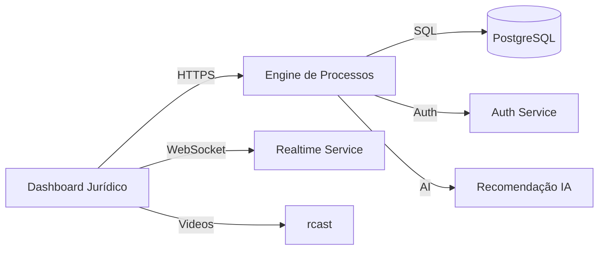

# Architecture Overview

## Visão Geral de Alto Nível

A plataforma **Rtrack** está organizada em cinco camadas principais:

1. **Dashboard Jurídico (UI)** – Interface web responsiva que permite advogados e clientes visualizar o progresso dos processos, status financeiros e recomendações de IA.
2. **Engine de Processos** – Serviço backend que gerencia o fluxo de etapas jurídicas, registra pareceres e controla o avanço dos casos.
3. **Módulo Financeiro** – Calcula custos, pagamentos pendentes e economia gerada por cada ação judicial.
4. **Recomendação de IA** – Algoritmo que sugere produtos e serviços adicionais com base no histórico do cliente.
5. **Conteúdo & Vídeos** – Integração com a plataforma **rcast** para disponibilizar vídeos explicativos e artigos de blog relevantes.

### Princípios de Design

- **Separação de Responsabilidades** – Cada camada tem um escopo bem definido.
- **Escalabilidade** – Serviços podem ser escalados horizontalmente; dados são armazenados em PostgreSQL com réplicas de leitura.
- **Segurança** – Uso de HTTPS, CSP, HSTS, cookies seguros e JWT para autenticação.
- **Observabilidade** – Logs estruturados, métricas e health‑checks em todos os serviços.

#### Diagrama de Interação

